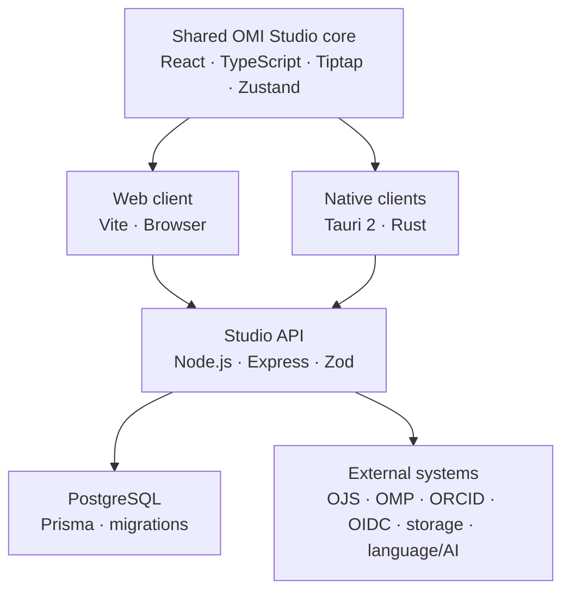

# Architecture

Open Manuscript Studio keeps scholarly structure independent from presentation, platform packaging, and external publishing workflow state.

## Main layers

### Shared authoring core

The frontend owns semantic manuscript editing, the document model, application state, import/export, publication styles, localization, and responsive user interfaces. Desktop and mobile are adapters around the same core rather than separate products.

Important source areas:

- `src/model/`, `src/types/`, and `src/schemas/` — OMI data and validation
- `src/editor/` — Tiptap editing and semantic extensions
- `src/document/` — document behavior, publication styles, and rendering support
- `src/app/` and `src/store/` — application and manuscript state
- `src/mobile/` — responsive/native navigation and platform adapters
- `src/integrations/` — client-side integration handoffs

### Native shell

`src-tauri/` provides Windows, Linux, macOS, Android, and iOS/iPadOS packaging and native capabilities. File access uses platform-native pickers and narrowly scoped permissions. Android uses the Storage Access Framework; iOS/iPadOS uses Files/UIDocumentPicker security-scoped access.

### Studio API

`server/src/` is an Express 5 TypeScript service. It provides accounts, sessions, federated identity, institutional administration, peer review, proofreading, imports, cloud storage, and external publishing-system integration routes. Zod validates configuration and request boundaries.

### Persistence

Prisma manages two PostgreSQL schemas and migration histories:

- the application database for Studio accounts, review state, publishing connections, cloud connections, and integrations;
- the identity database for portable profiles, institution membership, central administration, and identity-service state.

These stores remain isolated from OJS/OMP databases. Integration happens across signed, versioned HTTP contracts rather than direct cross-database access.

## Trust boundaries

- Manuscripts and review assignments remain local to the relevant Studio/publishing installation.
- Central identity must not expose the scholarly review graph.
- OJS or OMP remains authoritative for its submission workflow, rounds, assignments, and editorial decisions.
- Integration secrets stay on the server and are encrypted at rest.
- Administrative authority does not automatically grant manuscript or peer-review access.
- Browser and native clients never connect directly to PostgreSQL.

## Version boundaries

The following identifiers must not be conflated:

1. Studio application version
2. native store/package build number
3. portable OMI schema/model version
4. individual integration protocol/profile version

An application release may require no OMI migration. Schema changes require an explicit migration path and compatibility tests.

## Detailed references

- [Repository README architecture](https://github.com/open-manuscript-initiative/open-manuscript-studio#architecture)
- [Local-first storage](https://github.com/open-manuscript-initiative/open-manuscript-studio/blob/main/docs/local-first-storage.md)
- [Account and institutional profiles](https://github.com/open-manuscript-initiative/open-manuscript-studio/blob/main/docs/account-profiles.md)
- [OMI federated identity architecture](https://github.com/open-manuscript-initiative/open-manuscript-studio/blob/main/docs/architecture/omi-identity-federation.md)
- [Integration extension SDK](https://github.com/open-manuscript-initiative/open-manuscript-studio/blob/main/docs/integration-extension-sdk.md)
